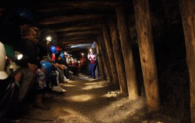

# Chiflón del Diablo, desde las entrañas de la tierra

###### 3 Noviembre 2016

Chiflon del Diablo En la Comuna de Lota, Región del Biobío, se encuentra ubicada la ex mina de carbón, Chiflón del Diablo, internada bajo el Océano Pacifico. Este lugar se encuentra abierto para el turismo, y los tour son guiados
