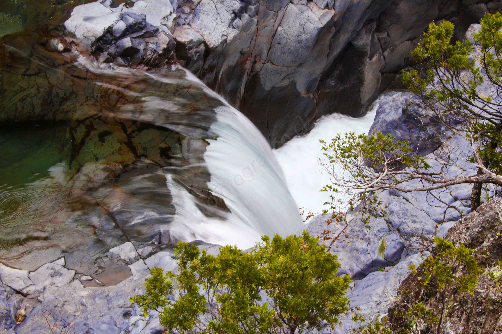

# Radal Siete Tazas y sus alrededores

###### 25 Noviembre 2016

La reserva natural siete tazas se encuentra ubicado a 3 horas de Santiago en la comuna de Molina. Para llegar a la reserva, los mochileros deben tomar una micro “buses radal” desde Molina, la que demora alrededor de 3 horas según las condiciones del lugar, es un camino de tierra y las pendientes se encuentran pavimentadas. Una vez llegando allá hay muchos lugares donde se puede acampar.

Radal siete tazas cuenta con númerosos lugares para hacer trekking.

Para los amantes de la fotografía de naturaleza es el lugar ideal, algunos de estos lugares son el sendero de los Chiquillanes, su recorrido dura 4 horas y podrán apreciar una vista sorprendente del valle y uno que otro pájaro carpintero.

Otro de los lugares bonitos es Malacara, ahí pondrán encontrar ríos, cascadas de agua, árboles nativos como el roble y cipreses,  duración 1 hora. Otro de estos es el salto de la leona, en el podrán encontrar una caída de agua altísima y muy helada color turquesa donde podrán bañarse.

Es aconsejable llevar ropa de abrigo y zapatillas outdoor ya que las condiciones climáticas varían muy rápido, en el día puede haber un sol maravilloso y por la noche puede hasta nevar.

Los invito a seguir marando más de estas imagenes y a visitar esta reserva natural de la Region del Maule, también pueden encontrar más información aquí

